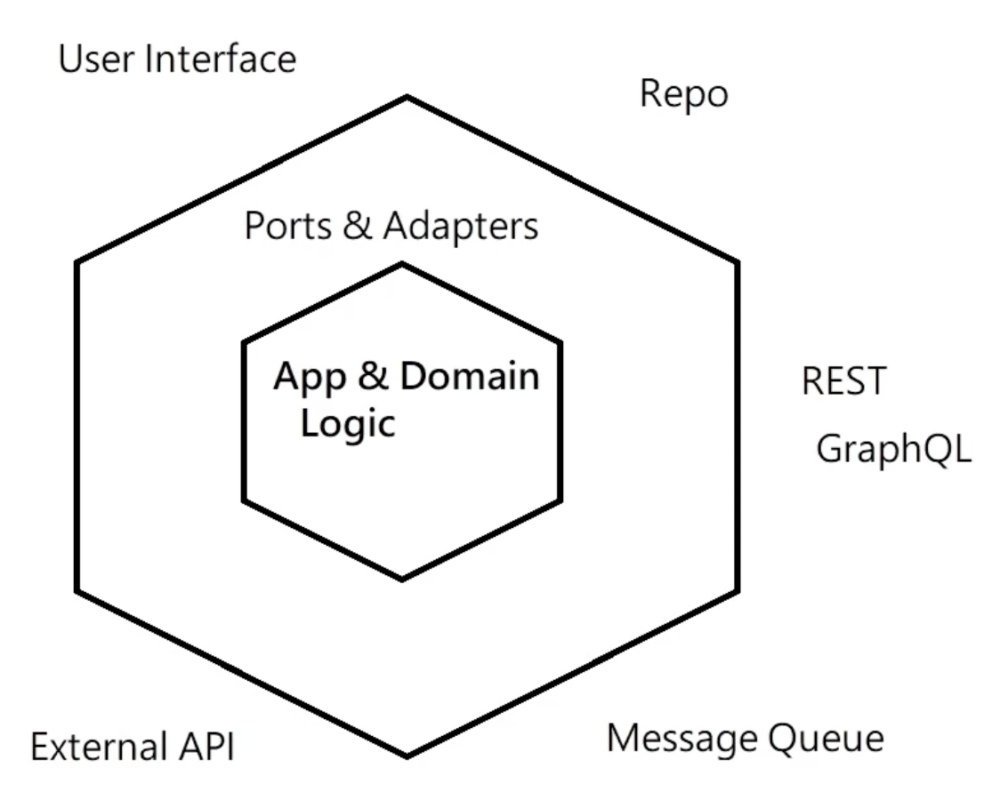

### URL shortener service

Service which offers shorter urls. 

#### Usage

Firstly, generate code for given url

```
http --json POST http://localhost:8000/ url=https://nikas-lebedenko.github.io/artist-event-assignment/
```

Afterwards visit `http://localhost:8000/{code}` and service will redirect you to final destination.


#### Side note
   
Dummy service to practice micro services and Go programming language. 
Current implementation is using hexagonal architecture.



Service can respond with `message pack` or `json` data format and store data in `redis` or `mongo db`.
Source for learning: https://www.youtube.com/watch?v=rQnTtQZGpg8  